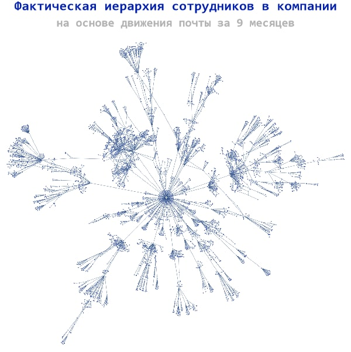

## Hi there,

## language:

- ENG
- RU

## интересы:

- применение математических методов в промышленности
- решение задач подготовки принятия решений
- оптимизация бизнес-процессов и вычисления на сетях
- нормализация и анализ данных
- машинное обучение и нейросети 
- построение имитационных моделей и цифровых двойников

## книги, публикуемые в этом репозитории:

|название|name|статус|
|:-|:-|:-|
|Конструктивная биология|Creating Biology|In progress: 35%|
|[Математическая морфология в примерах из медицины и биологии](../mathmorphology_book)|MathMorphology practical guide|In progress: 90%|
|Экспериментальная экономика|Digital Economy|Planned|

## избранные работы:

|||
|:-|:-|
|[Почта раскрывает реалии компании - оргструктуру, цепочки согласования и бизнес-процессы](https://t.me/dkkru/46)||
|[Формула решения уравнения 4 степени](https://habr.com/ru/articles/537068/)||
|[Всегда ли работает закон Парето или о факторе длинных хвостов](https://t.me/dkkru/680)||
|[Модели диффузии для анализа движения к целевым состояниям](https://t.me/dkkru/626)||
|[Применение модели “хищник-жертва” для задач бизнеса](https://t.me/dkkru/593)||

эти и 500+ лаконичных статей в [телеграм канале](https://t.me/dkkru)
-->
